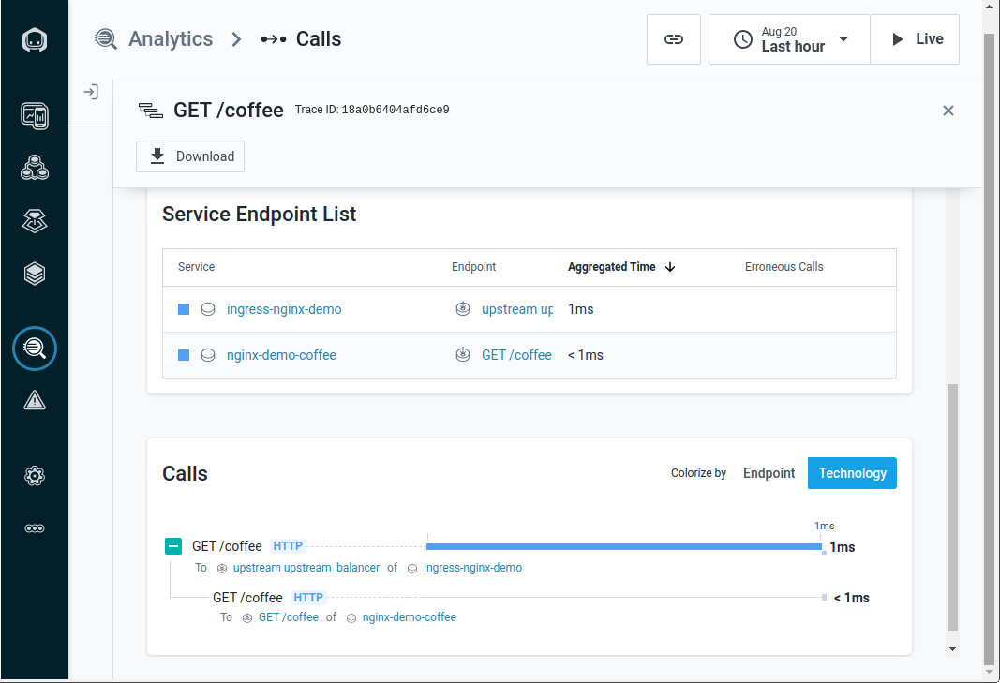

## Instana Tracing Example for Kubernetes NGINX Ingress

We use a modified version of the [NGINX Inc. NGINX Ingress OpenTracing example](https://github.com/nginxinc/kubernetes-ingress/tree/master/examples/opentracing).

A simple cafe application is deployed with Instana tracing which comes with an ingress resource. This demonstrates the load balancing and the span context propagation.

### Prerequisites

It is assumed that you have a working Kubernetes setup with Minikube using the VirtualBox driver.
You should have already [installed the Instana agent](https://www.instana.com/docs/setup_and_manage/host_agent/on/kubernetes/) in that setup which should be able to report data to the backend.
And you should have already followed the steps to install Kubernetes NGINX Ingress with Instana tracing.
The cloud generic settings work best for Minikube.

**Note:** The Instana agent does not work in a Kubernetes in Docker (kind) setup.

### Deploy the Cafe App

Run the following commands to copy over the image pull secret and to deploy the application:
```sh
kubectl create namespace ingress-nginx-demo
kubectl get secret instana-registry-key -n ingress-nginx -o yaml | grep -v "namespace:" | kubectl create -n ingress-nginx-demo -f -
kubectl apply -f example/deploy/cafe-all.yaml
```

### Check Deployment

1. Ensure everything is running and ready

   ```sh
   kubectl get all -n instana-agent
   kubectl get all -n ingress-nginx
   kubectl get all -n ingress-nginx-demo
   ```

2. Ensure the tracer is loaded and connected

   ```sh
   kubectl logs -n ingress-nginx $(kubectl get pods -n ingress-nginx | tail -n1 | cut -d ' ' -f1)
   kubectl logs -n ingress-nginx-demo $(kubectl get pods -n ingress-nginx-demo | tail -n1 | cut -d ' ' -f1)
   ```

   You should see that the "Instana C++ Sensor" has been loaded. It takes a while until the agent connection is established.
   There should be no more lookup request errors for a minute.

### Test Tracing

1. Get the Ingress controller IP and port

   ```sh
   export IC_IP=$(minikube ip)
   export IC_HTTPS_PORT=$(kubectl get svc -n ingress-nginx | grep "ingress-nginx.*LoadBalancer" | grep -o "443:[0-9]\+" | cut -d ':' -f2)
   ```

2. Issue requests

   Coffee:
   ```sh
   curl --resolve cafe.example.com:$IC_HTTPS_PORT:$IC_IP https://cafe.example.com:$IC_HTTPS_PORT/coffee --insecure
   ```
   output:
   ```
   Server address: 172.17.0.4:8080
   Server name: coffee-68dc989ddb-vqckp
   ...
   ```

   Tea:
   ```sh
   curl --resolve cafe.example.com:$IC_HTTPS_PORT:$IC_IP https://cafe.example.com:$IC_HTTPS_PORT/tea --insecure
   ```
   output:
   ```
   Server address: 172.17.0.7:8080
   Server name: tea-7c5459484d-nxl2t
   ...
   ```

3. See the requests on the Instana APM UI

   The services are called `ingress-nginx-demo` and `nginx-demo-coffee` or `nginx-demo-tea`.

   
